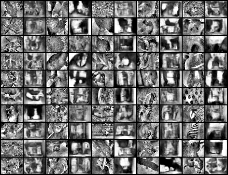
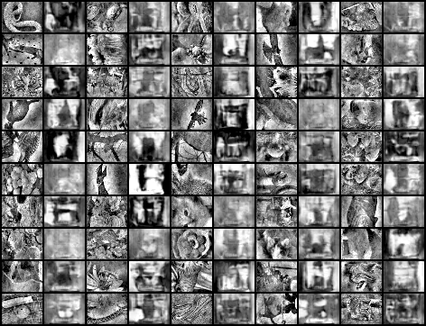

# decoding natural images
This project is trying to decode grayscale naturalistic images from calcium imaging recordings in mouse cortex. The data is from [stringer et al 2018](https://github.com/MouseLand/stringer-pachitariu-et-al-2018b) and includes simultaneous recordings from 10,000 neurons.

The idea is to use a pre-trained gan from [this repo](https://github.com/csinva/pytorch_gan_pretrained) based on the [dcgan](https://github.com/pytorch/examples/tree/master/dcgan) and learn a linear mapping from the neurons to the latent space of the GAN generator.

So far the results are not very good. Some samples are shown below. Starting from the left, every two columns show the real data samples and the generated data samples:

| training                                            | validation                                           |
| ------------------------------------------------------------ | ------------------------------------------------------ |
|  |  |

# code
- the `train.py` file contains the bulk of the code for training
- the `scripts` folder contains files for sweeping over parameters
- many things left to do
  - try different loss functions for generating images that are more perceptially similar (e.g. vgg perceptual loss)
  - different types of normalization
  - augment data (add rotates, etc.)
  - try learning w/ poisson distr.
